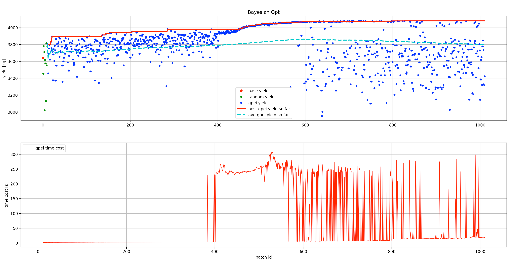

PenSimEnv
=========

Penicillin Control Challenge
----------------------------

This challenge aims to find the best approach to optimize penicillin
yield (i.e. output) by manipulating recipes (i.e. inputs). The
simulation can be found `here <https://github.com/Quarticai/PenSimPy>`_ and
the corresponding reactor tank can be found below. Here we focus on a
batch process that different recipes are fed as the inputs (like oil
flow, sugar flow, and water flow) and the penicillin generated within
each batch process. Since not all the reactants can be measured directly
by sensors or be measured on time, parts of the feature variables (15 in
total) are provided by excluding the off-line and off-gas measurements.
Details can be found `here <https://www.sciencedirect.com/science/article/abs/pii/S0168165614009377>`_.

.. code::

   ['Discharge rate', 'Sugar feed rate', 'Soil bean feed rate', 'Aeration rate', 'Back pressure', 'Water injection/dilution', 'pH', 'Temperature', 'Acid flow rate', 'Base flow rate', 'Cooling water', 'Heating water', 'Vessel Weight', 'Dissolved oxygen concentration', 'Yield Per Step']

And for each batch, a .csv file is given and it can be easily
manipulated with pandas dataframe (1150 \* 15) and the total penicillin
yield can be calculated by summing up the 'Yield Per Step' column.

.. image:: imgs/pen1.jpeg

Also, it is worthy to mention that each batch has a duration of 230 h
(in order to simulate the real industrial process) and each sub-step has
a duration of 12 min, which means we have 1150 steps. By leveraging the
`ode solver in C++ <https://github.com/Quarticai/fastodeint>`_, the total
time cost of one single batch reaction is ~1 s.

Problem Setup
-------------

1. You will start with a dataset of 10 run batches (that is generated
   with random variants of the default recipes). The 6 default recipes,
   namely, :code:`'Discharge rate', 'Sugar feed rate', 'Soil bean feed rate',
   'Aeration rate', 'Back pressure', 'Water injection/dilution'` have
   step shapes and randomly search within a range of +/- 10% for each
   point. The figure below illustrates how the 'Sugar feed rate' recipe
   and its searching space looks like.

   .. image:: imgs/pen2.png

2. You will need to come up with a way to control the process to
   optimize two things simultaneously:

   a. the best batch yield (i.e., maximum yield of all batches)

   b. the average batch yield (i.e. mean yield of all batches)

3. In total, you will run your control strategy for 1000 batches. And to
   evaluate the result, two plots need to be generated:

   a. the best batch yield so far

   b. the average batch yield so far

4. You will at least need to perform better than the baseline, which is
   generated with Bayesian Optimization (BayesOpt) as its core.

   a. best batch yield plot (best so far)

   b. average batch yield plot (accumulated)

   c. actual numerical result (1k), as well as the code to generate it,
      can be accessed. Also to record the time it takes to run BayesOpt
      for each batch.

-  The baseline optimization results that contain 10 random starts +
   1000 gpei searches are displayed below.

The base penicillin yield (in red diamond point, ~3640 kg) is based on
the baseline recipe without any optimizations. The first 10 random
searching results are plotted in green stars and the following 1000 gpei
searches are displayed in blue stars. The red line refers to the best
yield so far and the cyan dashed line shows the average yields so far,
respectively. Also, the time cost for each optimization step (mainly on
gpei) was recorded and displayed in red. Some key statistics are shown
in the table below.

==== ========================= =============================
\    **Penicillin Yield [kg]** **Time Elapsed for GPEI [s]**
==== ========================= =============================
min  2954                      2.23
max  4080 (⬆️ 12%)             323.07
mean 3797 (⬆️ 4%)              77.44
std  233                       109.55
sum  very high                 77437.72 (21.51 h)
==== ========================= =============================

-  | Data appendix
   | As we mentioned earlier, the batch data are provided with .csv
     files and the naming fashion are random_batch_0.csv and
     gpei_batch_0.csv, where 0 refers to the batch id. Additionally,
     some .pickle files were recorded for reproduction purposes and you
     do not need to worry about them :). All the data can be generated. 
     However, keep in mind that you are only allowed to start with the
     10 random batches for your optimization approach, the gpei ones are
     there for reference only.

Additional Notes
----------------

1. Try to have a generic approach. That is, your approach shouldn’t
   overfit too much to this problem (e.g. brutal force
   hyperparameters/model selections, etc.) Think of approaches that can
   be generalized and directly applied to other processes without any
   tweaks.

2. One random idea that may (or may not) work (**some preliminary result
   indicates that this may not work!**):

   1. Run X batches with BayesOpt (or other gradient-free algorithms
      like evolution-based ones)

   2. Imitate BayesOpt with some model/policy

   3. Set some threshold when the imitator will replace BayesOpt

   4. Imitator can also try to learn the system model may be (e.g.
      model-based RL)

3. Another random idea: maybe instead of imitation, try to see if we can
   have a more sample efficient offline RL algorithm that is similar to
   conservative Q-learning (**some impressive preliminary result
   here!**)

4. Yet another one: Maybe just have better blackbox optimization methods
   than BayesOpt? maybe can get some inspiration from `here <https://arxiv.org/abs/2104.10201>`_.

Benchmarks
----------

*The search space here is +/- 10% away from recipe setpoints.*

https://github.com/microsoft/FLAML

You can find the benchmark code here
https://github.com/Quarticai/DSResearch/blob/master/blendsearch_tune/flaml_tune.ipynb

It doesn't utilise the 10 random batches and the performance looks much
more stable than Hilo.

More results can be found here
https://github.com/Quarticai/DSResearch/tree/master/blendsearch_tune

A summary of results (default recipe yield: 3677):

================= ========== =========== =========
**Method**        **Avg**    **Max**     **Speed**
================= ========== =========== =========
AX                3796, 3.2% 4084, 11%   slow
Optuna            3985, 8.3% 4044, 9.9%  fast
Flaml/Blendsearch 4020, 9.3% 4076, 10.8% fast
HEBO              3918, 6.5% 4119, 12%   very slow
TuRBO             4027, 9.5% 4090, 11.2% fast
Openbox           3989, 8.4% 4079, 10.9% fast
================= ========== =========== =========

Average across all BayesOpt frameworks:

7.53% average improvement, 11% max improvement.

Comparison of near recipe (+/- 10%) VS no recipe for 100 batches
----------------------------------------------------------------

blendsearch: near recipe: 6.7% avg, and 9.7% max.

.. image:: imgs/image5.png

blendsearch: widest search space: -28.65% avg, 13% max

.. image:: imgs/image6.png

optuna: (4.4% avg, 8.2% max)

.. image:: imgs/image7.png

optuna without recipe: -29.6% avg, 12.23% max

.. image:: imgs/image8.png

Now run blendsearch with the widest search space: (-11.1% avg, 41.3%
max)

|image1|\ |image2|

.. |image1| image:: media/image9.png
.. |image2| image:: media/image10.png

PenSimEnv module
----------------

.. automodule:: quarticgym.envs.pensimenv
   :members:
   :undoc-members:
   :show-inheritance:
   :noindex:
